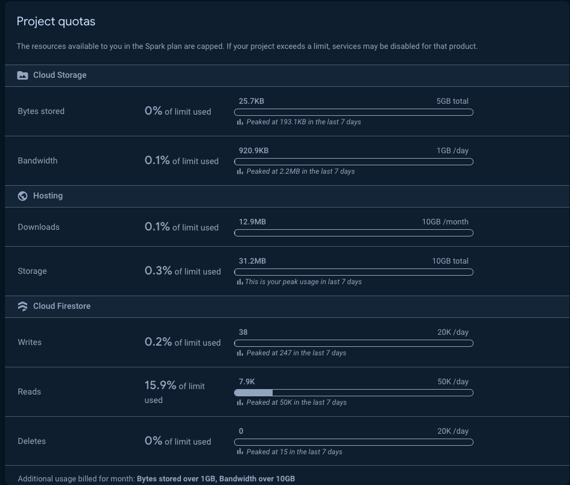

### Uploading and Downloading Video Files from Firebase

—-----------------------------------------------------

Downloading appears to be fine for files of a larger size.

Uploading presents an issue in terms of time taken

—------------------------------------------------------

### Uploading files over 5mb takes too long.

A 30 second video filmed on an Iphone 10 (which seems like a good basic measure) is 48mb in standard settings. This would take by the current standard upwards of 30 seconds to upload which seems too long.

—-----------------------------------------------------

### Storage and Transmission Available via Firebase

We appear to have 5gb of free storage on the current plan with more storage appearing relatively inexpensive. 1gb of data transmission per day seems more likely to be limiting. In the case of the 30 second Iphone video that would be roughly 20 videos uploaded per day would reach the limit.

Firebase limits for storing images and video.

—-----------------------------------------------------

### Playing Video in React

There are multiple options for displaying the video however we have found that the built in video element functions fine. For a comprehensive list of other functions built within React you can see this document.

https://blog.logrocket.com/guide-video-playback-react/

—-----------------------------------------------------

The documentation for downloading files to Web Based Applications from Firebase.
https://firebase.google.com/docs/storage/web/download-files#download_data_via_url

The documentation for uploading files to Web Based Applications from Firebase.
https://firebase.google.com/docs/storage/web/upload-files

—-----------------------------------------------------

uploading video files in React
https://www.youtube.com/watch?v=wuArhMaD5Hc&t=933s
